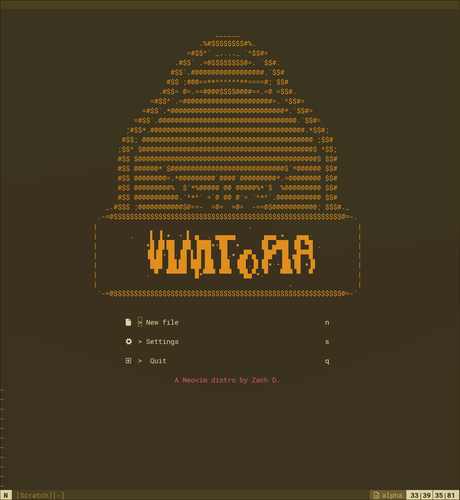
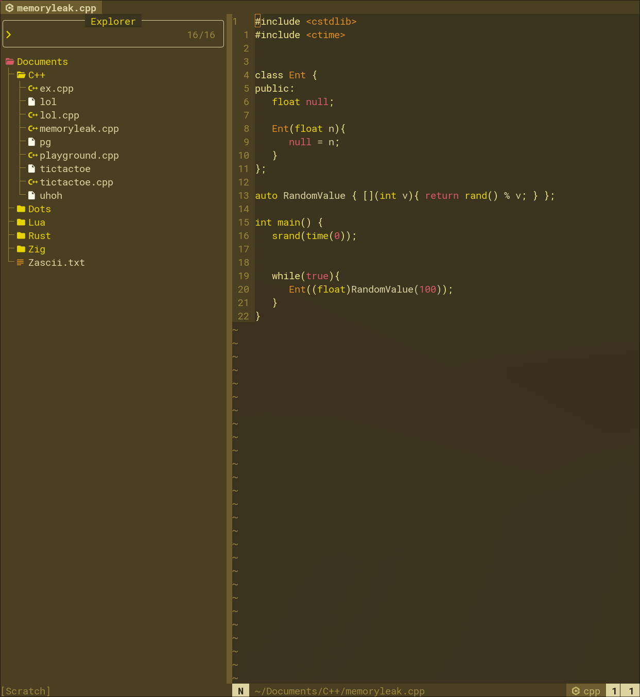
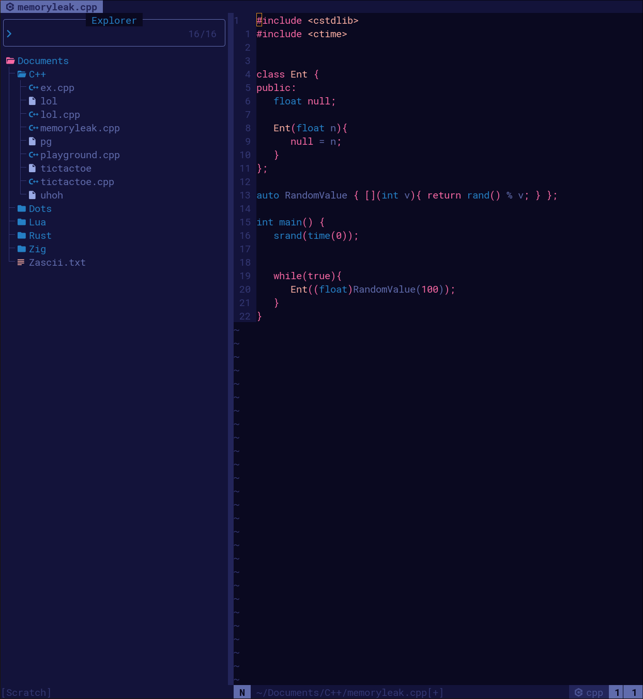

# WELCOME TO...

### This is my personal Neovim config, built from scratch with .
 I am constantly changing and tweaking things about this config... clone at own risk! 

## -=@ PLUGINS (Managed with Neorocks) @=-

- rocks.nvim (+ git)
- alpha
- colorizer
- cozy-line-numbers
- diagflow
- lspconfig
- mini
- neorg
- noice
- toggleterm
- tree-sitter
- which-key
- web-devicons

## -=@ INSTALLING @=- 
### DEPENDANCIES: 

- Git
- Lua 5.1
- Luarocks

 Please install these with your package manager of choice 

Installing *should* be as easy as cloning this repo into your `~/.config/nvim` directory.

### INSTALL:

If you **do not** currently have a Neovim config setup, you can easily install VimTopia with this command: 

`git clone https://github.com/ProsperousTroll/VimTopia ~/.config/nvim && nvim`

If you **do** have a Neovim config, you should back up your current files before replacing them with VimTopia with the above command.

after Neovim opens and luarocks installs itself *(ideally...)*, Nvim will open and show a bunch of errors. **This is normal.**

All you have to do now is run (in Neovim): 

`:Rocks sync`

After syncing the plugins and restarting Neovim, VimTopia is successfully installed!

### TROUBLESHOOTING:

I ran into this problem on one of my two machines, where Luarocks/rock.nvim *could not locate the lua header file provided by the Lua 5.1 package.*

The solution to this problem was quite simple, all you have to do is locate the lua header file (`lua.h`) and copy it to a new folder in your root directory called `include/lua51/`. If, for some reason, more than like one other person is using VimTopia and this issue is common, I'll find a better solution.

## -=@ THEMES @=-

There are 2 base-16 themes built into VimTopia: NewGruvCity (By me), and Eris (By )

New Gruv City

Eris

You can select either by opening `lua/plugins/mini.lua` and replacing the option `palette` with whichever option you want.

## -=@ KEYBINDS @=-

### VimTopia's special keybinds:

- `<C-h|j|k|l>` : Change focused window
- `<Space>` : Leader key
- `<leader>e` : Open file manager
- `<leader>t` : Toggle terminal window
- `<leader>q` : Close buffer
- `<leader>n` : New buffer
- `s` : , usefull asf 

## -=@ THANKS! @=-

Thanks for looking at VimTopia!

I hope 1 other people in the world will use it one day...
